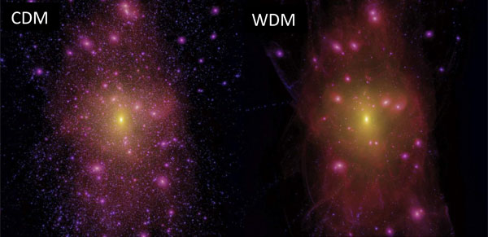
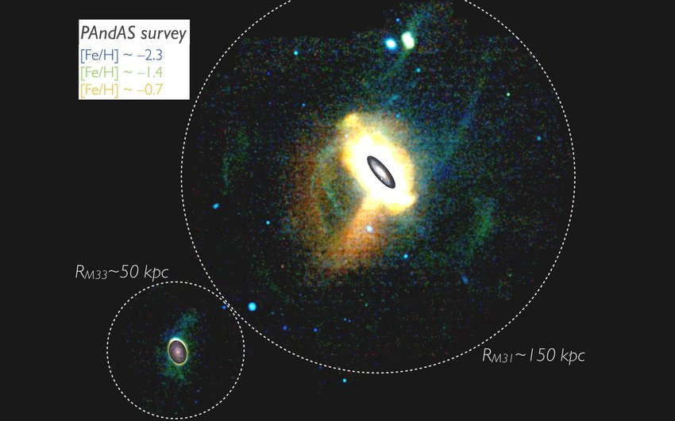
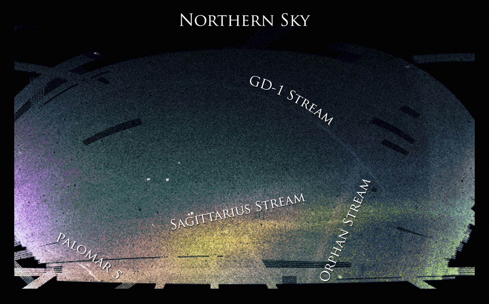
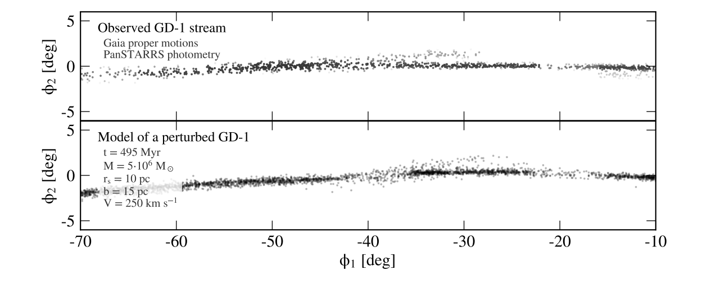
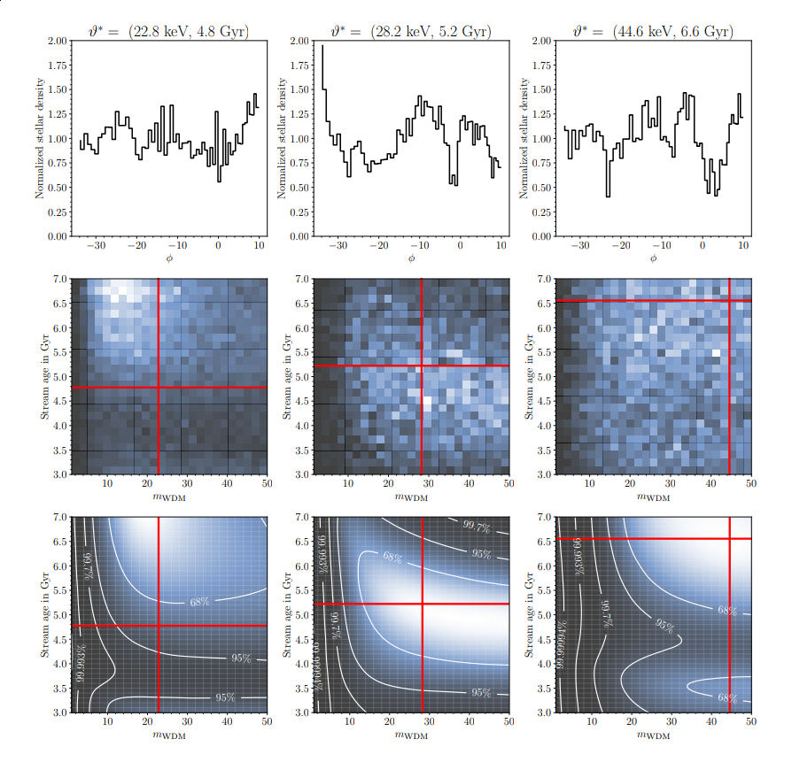
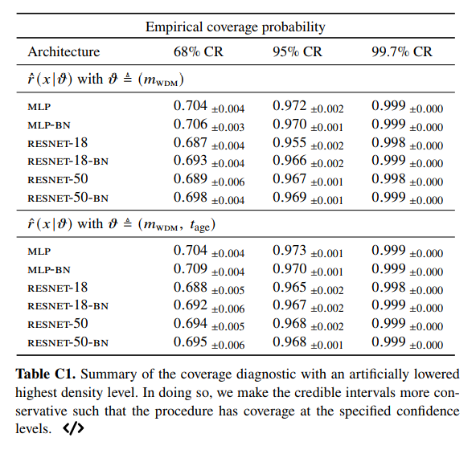
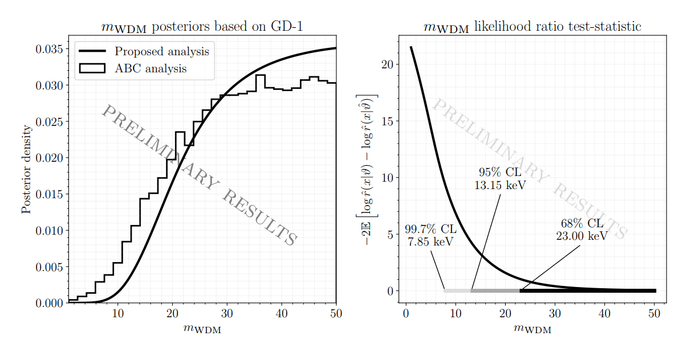

class: title-slide
count: false

# Simulation-based inference with Amortised Approximate Density Ratio Estimators

.small[An introductory tutorial]
---
class: middle

.center[[tutorial/tutorial.ipynb](https://github.com/JoeriHermans/COMPASS-Seminar/blob/master/tutorial/tutorial.ipynb)]
---
class: middle

### Application
## Towards constraining warm dark matter with neural simulation-based inference
   
[arxiv.org/abs/2011.14923](https://arxiv.org/abs/2011.14923)
---
class: middle

# Quick recap!

---
class: middle

In **Bayesian inference**, we are interested in the *posterior*:

$$
p(\theta\vert x) = \frac{p(\theta)p(x\vert\theta)}{\int p(\theta)p(x\vert\theta) d\theta}
$$
Even more complicated in the likelihood-free scenario:
- .red[Cannot evaluate] the likelihood $p(x\vert\theta) = \int p(x,z\vert\theta)~dz$
- .red[Cannot evaluate] the evidence term $p(x) = \int p(\theta)p(x\vert\theta)~d\theta$

 
## .center[**We have to rely on approximations!**]
---
class: middle

## Amortizing Bayes
 
Notice that Bayes rule can be written as
$$
p(\theta\vert x) = \frac{p(\theta)p(x\vert\theta)}{p(x)} = p(\theta)\frac{p(x\vert\theta)}{p(x)} = p(\theta)r(x\vert\theta),
$$
where $r(x\vert\theta)$ is the likelihood-to-evidence ratio.
---
class: middle

### .center[.red[**Remember:** classification is essentially density ratio estimation!]]
 
### **Proposal**: Train a *discriminator* $d(x,\theta)$ with inputs $x$ and $\theta$
.center[.width-60[]]
### to distinguish between samples from:
- the *joint* $p(x,\theta)$ (class 1),
- and the *product of marginals* $p(x)p(\theta)$ (class 0).
---
class: middle
You can show that the decision function of the optimal classifier yields
$$
d(x, \theta) = \frac{p(x,\theta)}{p(x,\theta) + p(\theta)p(x)},
$$
$$
\frac{1 - d(x,\theta)}{d(x,\theta)} =  \frac{p(x,\theta)}{p(x)p(\theta)} = \frac{p(x\vert\theta)}{p(x)} = r(x\vert\theta)
$$
### Subsequently, *amortized* estimates of the PDF can be obtained by computing
$$
p(\theta\vert x) = p(\theta)r(x\vert\theta)~\text{for arbitrary}~\theta\sim p(\theta)~\text{and}~x\sim p(x\vert\theta).
$$
  
$$
\log \hat{p}(\theta\vert x) = \log p(\theta) + \log \hat{r}(x\vert\theta) = \log p(\theta) + \text{logit}(d(x,\theta))
$$
.center[.width-50[]]
---
class: middle

## .red[<h3>Complete Deep Learning toolbox can be applied to statistical inference, and therefore used to infer properties* of our Universe!</h3>]

.footnote[Under some assumed model]
---
class: middle,center,no-side-padding

.width-100[]
 
## Particle mass in $\mathcal{O}(\text{GeV})$ (CDM) vs. $\mathcal{O}(\text{keV})$ (WDM) range

---
.width-100[]
.footnote[Credit: Martin, et al. (2013). The PAndAS view of the Andromeda satellite system. I. A Bayesian search for dwarf galaxies using spatial and color-magnitude information. The Astrophysical Journal, 776(2), 80.]
---
<video width="100%" style="position: relative; top: -25px;" autoplay controls loop><source src="figures/pal5-impacts.webm">Your browser does not support video.</video>
.footnote[Credit: Erkal, et al. (2017). A sharper view of Pal 5's tails: discovery of stream perturbations with a novel non-parametric technique. Monthly Notices of the Royal Astronomical Society, 470(1), 60-84.]
---
class: center,middle,no-side-padding

.width-100[]
---
class: middle

.width-100[]
Distant passage from galactic center $\rightarrow$ "neglegible" baryonic pertubations
## **GD-1 gaps are a good probe for DM substructures!**
 
.footnote[Credit: Bonaca, A., Hogg, D. W., Price-Whelan, A. M., & Conroy, C. (2019). The Spur and the Gap in GD-1: Dynamical evidence for a dark substructure in the Milky Way halo. The Astrophysical Journal, 880(1), 38.]
---
class: middle

# How?

Simple, just like we did in the tutorial!

1. Define a prior $p(\vartheta)$ over $m_\text{wdm}$.
2. Draw samples from the joint $p(\vartheta, x)$ (a training and testing dataset).
3. Train several ratio estimators (for ensembling).
4. Compute posteriors.

---
class: middle, center

.width-80[]
---
class: middle
.center[# **Problem!**]
  
## Are the approximations trustworthy?
---
## Does the mode converge to $\vartheta^*$ for i.i.d. observables?

In other words, compute $p(\vartheta\vert\mathcal{X})$ with $\mathcal{X} = \\{x\sim p(x\vert\vartheta^*), ...\\}$.

.center[]
---
## **Coverage** at various confidence levels?

.center[.width-80[]]
---
class: middle, center

.width-100[]
---
class: middle

.center[Always interested in helping out!]
  
.center[.red[Try for yourself!]]

<h2>github.com/montefiore-ai/hypothesis</h2>

.center[### joeri.hermans@doct.uliege.be]
