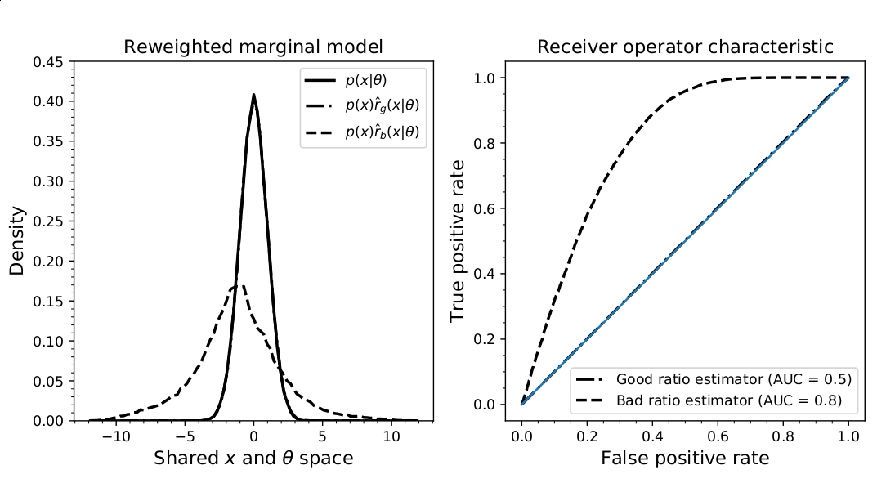
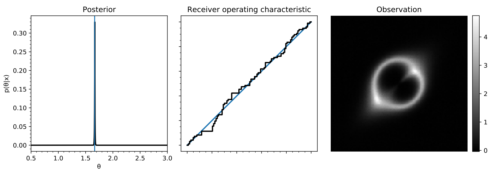

class: title-slide
count: false

# Likelihood-free MCMC with Amortized Approximate Likelihood-Ratios

.small[**Joeri Hermans$^1$**, Volodimir Begy$^2$, Gilles Louppe$^1$]
 
 
.smallest[$^1$University of Liège, Belgium] 
.smallest[$^2$University of Vienna, Austria]
---
class: middle

.center.width-100[]
  
.center[Inference in this context requires **likelihood-free algorithms**.]

.footnote[Credits: Johann Brehmer.]
---
class: middle

In **Bayesian inference**, we are interested in the *posterior*:

$$
p(\theta\vert x) = \frac{p(\theta)p(x\vert\theta)}{\int p(\theta)p(x\vert\theta) d\theta}
$$
Even more complicated in the likelihood-free scenario:
- .red[Cannot evaluate] the likelihood $p(x\vert\theta) = \int p(x,z\vert\theta)~dz$
- .red[Cannot evaluate] the evidence term $p(x) = \int p(\theta)p(x\vert\theta)~d\theta$

 
## .center[**We have to rely on approximations!**]
---
class: middle

## Amortizing Bayes
 
Notice that Bayes rule can be written as
$$
p(\theta\vert x) = \frac{p(\theta)p(x\vert\theta)}{p(x)} = p(\theta)\frac{p(x\vert\theta)}{p(x)} = p(\theta)r(x\vert\theta),
$$
where $r(x\vert\theta)$ is the likelihood-to-evidence ratio.
---
class: middle

### .center[.red[**Remember:** classification is essentially density ratio estimation!]]
 
### **Proposal**: Train a *discriminator* $d(x,\theta)$ with inputs $x$ and $\theta$
.center[.width-60[]]
### to distinguish between samples from:
- the *joint* $p(x,\theta)$ (class 1),
- and the *product of marginals* $p(x)p(\theta)$ (class 0).
---
class: middle
You can show that the decision function of the optimal classifier yields
$$
d(x, \theta) = \frac{p(x,\theta)}{p(x,\theta) + p(\theta)p(x)},
$$
$$
\frac{1 - d(x,\theta)}{d(x,\theta)} =  \frac{p(x,\theta)}{p(x)p(\theta)} = \frac{p(x\vert\theta)}{p(x)} = r(x\vert\theta)
$$
### Subsequently, *amortized* estimates of the PDF can be obtained by computing
$$
p(\theta\vert x) = p(\theta)r(x\vert\theta)~\text{for arbitrary}~\theta\sim p(\theta)~\text{and}~x\sim p(x\vert\theta).
$$
  
$$
\log \hat{p}(\theta\vert x) = \log p(\theta) + \log \hat{r}(x\vert\theta) = \log p(\theta) + \text{logit}(d(x,\theta))
$$
.center[.width-50[]]
---
class: middle,center,no-side-padding

<h2>.red[<h3>Complete Deep Learning toolbox can be applied to inference!]</h2>
---
## Quality of the approximation $\hat{r}(x\vert\theta)$
Consider the identity
$$
p(x)\frac{p(x\vert\theta)}{p(x)} = p(x\vert\theta).
$$
The ratio estimator should satisfy $p(x)\hat{r}(x\vert\theta) = p(x\vert\theta)$, else it's .red[**wrong**].
### .red[Intractable, but we can sample from these densities!] $\rightarrow$ AUC $\approx$ 0.5
.center[.width-70[]]
.footnote[Inspired by 1506.02169, alternative diagnostic SBC 1804.06788]
---
## Likelihood-free MCMC

MCMC samplers require the evaluation of the posterior ratios:
$$
\begin{aligned}
\frac{p(\theta\_\text{new}|x)}{p(\theta\_{t-1}|x)} &= \frac{p(x|\theta\_\text{new}) p(\theta\_\text{new}) / p(x)}{p(x|\theta\_{t-1}) p(\theta\_{t-1}) / p(x)} \\\\
&= \frac{r(x\vert\theta\_\text{new})}{r(x\vert\theta\_{t-1})}\frac{p(\theta\_\text{new})}{p(\theta\_{t-1})}.
\end{aligned}
$$

Extensions with HMC is possible since $\nabla\_\theta \log p(x\vert\theta) = \Large\frac{\nabla\_\theta~r(x\vert\theta)}{r(x\vert\theta)}$.

.width-100[]
---
## Amortization and simulation efficiency
  
.width-100[]
---
class: middle

## Off-the-shelf neural architectures
 
.center[.width-80[]]
.center[.width-70[]]
.footnote[Lensing simulations by https://github.com/Jammy2211/PyAutoLens]

---
## Conclusion

- We presented an inference pipeline based on a new ratio estimator.
- All advances in Deep Learning can easily applied in this methodology.
- Quality of the approximation can be probed with a diagnostic.
- Posterior samples can be drawn with this ratio estimator.
- Demonstrated on realistic problems with high dimensional observations.

  
.center[.red[Try for yourself!]]

<h2>github.com/montefiore-ai/hypothesis</h2>

.center[### joeri.hermans@doct.uliege.be]
